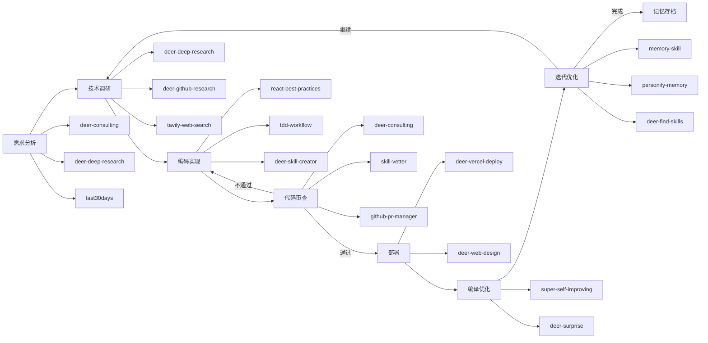

# OpenCode 代码自动工作流

## 完整工作流: 需求分析 → 技术调研 → 编码实现 → 代码审查 → 部署 → 优化 → 迭代

---

## 阶段1: 需求分析

### 技能
| 技能 | 路径 | 功能 |
|------|------|------|
| deer-consulting | deer-consulting/ | 需求咨询与评估 |
| deer-deep-research | deer-deep-research/ | 背景研究 |
| last30days | last30days/ | 热点趋势分析 |
| super-self-improving | super-self-improving-1.1.0/ | 元学习分析 |

### 触发词
- "帮我分析需求"
- "这个项目做什么"
- "我要做一个XX"

### 工作流
```
用户需求
    ↓
deer-consulting (需求咨询)
    ↓
deer-deep-research (背景研究)
    ↓
last30days (趋势分析)
    ↓
super-self-improving (方案评估)
    ↓
输出: 需求文档 + 技术方案
```

---

## 阶段2: 技术调研

### 技能
| 技能 | 路径 | 功能 |
|------|------|------|
| deer-deep-research | deer-deep-research/ | 深度网络研究 |
| deer-github-research | deer-github-research/ | GitHub项目分析 |
| deer-data-analysis | deer-data-analysis/ | 技术栈数据分析 |
| tavily-web-search | tavily-web-search-for-openclaw-1.0.0/ | 技术搜索 |
| liang-tavily-search | liang-tavily-search-1.0.1/ | Tavily搜索 |

### 触发词
- "调研一下这个技术"
- "看看GitHub上有什么方案"
- "有什么最佳实践"

### 工作流
```
技术方案
    ↓
deer-deep-research (技术调研)
    ↓
deer-github-research (GitHub研究)
    ↓
tavily-web-search (补充搜索)
    ↓
deer-data-analysis (对比分析)
    ↓
输出: 技术选型 + 方案对比 + 参考资料
```

---

## 阶段3: 编码实现

### 技能
| 技能 | 路径 | 功能 |
|------|------|------|
| react-best-practices | react-best-practices-1.0.0/ | React最佳实践 |
| deer-skill-creator | deer-skill-creator/ | 技能/代码生成 |
| deer-claude-to-deer | deer-claude-to-deer/ | 技术迁移 |
| tdd-workflow | tdd-workflow/ | TDD开发模式 |
| browser-use | browser-use-1.0.2/ | 浏览器自动化 |
| frontend-design-pro | frontend-design-pro-1.0.0/ | 前端设计 |

### 触发词
- "开始编码"
- "写代码"
- "用TDD模式开发"

### TDD 开发流程
```
RED (红) → GREEN (绿) → REFACTOR (重构)
    ↓
1. 先写失败测试 (npm test / pytest / cargo test)
2. 写最小代码通过
3. 重构优化
```

### 工作流
```
技术方案
    ↓
react-best-practices (最佳实践参考)
    ↓
tdd-workflow (TDD模式启动)
    ↓
deer-skill-creator (代码生成)
    ↓
deer-claude-to-deer (技术迁移)
    ↓
输出: 可运行代码 + 测试用例
```

---

## 阶段4: 代码审查

### 技能
| 技能 | 路径 | 功能 |
|------|------|------|
| deer-consulting | deer-consulting/ | 代码审查建议 |
| skill-vetter | skill-vetter-1.0.0/ | 技能/代码审核 |
| github-pr-manager | github-pr-manager-1.0.0/ | PR管理审查 |
| deer-vercel-deploy | deer-vercel-deploy/ | 部署前检查 |

### 触发词
- "审查代码"
- "看看有什么问题"
- "检查PR"

### 工作流
```
代码
    ↓
deer-consulting (代码审查)
    ↓
skill-vetter (质量审核)
    ↓
github-pr-manager (PR审查)
    ↓
输出: 审查报告 + 修改建议
```

---

## 阶段5: 落地开发/部署

### 技能
| 技能 | 路径 | 功能 |
|------|------|------|
| deer-vercel-deploy | deer-vercel-deploy/ | Vercel部署 |
| deer-web-design | deer-web-design/ | 网页设计 |
| deer-frontend-design | deer-frontend-design/ | 前端设计 |
| deer-chart-visual | deer-chart-visual/ | 数据可视化 |
| opencode-notifier | opencode-notifier/ | 部署通知 |

### 触发词
- "部署"
- "发布"
- "上线"

### 工作流
```
审查通过
    ↓
deer-web-design (网页设计)
    ↓
deer-vercel-deploy (Vercel部署)
    ↓
opencode-notifier (通知)
    ↓
输出: 线上地址 + 部署报告
```

---

## 阶段6: 编译补充与优化

### 技能
| 技能 | 路径 | 功能 |
|------|------|------|
| super-self-improving | super-self-improving-1.1.0/ | 自我优化 |
| supermemory | supermemory/ | 永久记忆 |
| deer-surprise | deer-surprise/ | 优化建议 |
| summarize | summarize-1.0.0/ | 总结优化点 |

### 触发词
- "优化一下"
- "怎么改进"
- "性能调优"

### 工作流
```
部署完成
    ↓
super-self-improving (自我分析)
    ↓
deer-surprise (优化建议)
    ↓
summarize (总结)
    ↓
supermemory (记忆优化点)
    ↓
输出: 优化清单 + 性能报告
```

---

## 阶段7: 迭代优化 (循环回到阶段2)

### 技能
| 技能 | 路径 | 功能 |
|------|------|------|
| super-self-improving | super-self-improving-1.1.0/ | 持续学习 |
| memory-skill | memory-skill/ | 本地记忆 |
| personify-memory | personify-memory-1.3.2/ | 个性化记忆 |
| deer-find-skills | deer-find-skills/ | 发现新技能 |
| super-self-improving | super-self-improving-1.1.0/ | 反馈收集 |

### 触发词
- "继续迭代"
- "下一个版本"
- "收集反馈"

### 工作流
```
优化清单
    ↓
memory-skill (记录当前状态)
    ↓
personify-memory (用户偏好记忆)
    ↓
super-self-improving (学习改进)
    ↓
deer-find-skills (发现新工具/技能)
    ↓
循环 → 阶段2: 技术调研
```

---

## 完整工作流图



---

## 技能调用指南

### 启动完整流程
```
开始项目开发
```

### 单阶段执行
| 阶段 | 命令 |
|------|------|
| 需求分析 | /learn @deer-consulting |
| 技术调研 | /learn @deer-deep-research |
| 编码实现 | /learn @tdd-workflow |
| 代码审查 | /learn @skill-vetter |
| 部署 | /learn @deer-vercel-deploy |
| 优化 | /learn @super-self-improving |
| 迭代 | /learn @memory-skill |

---

## 技能索引

| 阶段 | 技能 | 优先级 |
|------|------|--------|
| 1.需求 | deer-consulting | ⭐⭐⭐ |
| 1.需求 | deer-deep-research | ⭐⭐ |
| 1.需求 | last30days | ⭐⭐ |
| 2.调研 | deer-github-research | ⭐⭐⭐ |
| 2.调研 | deer-deep-research | ⭐⭐⭐ |
| 2.调研 | tavily-web-search | ⭐⭐ |
| 3.编码 | tdd-workflow | ⭐⭐⭐ |
| 3.编码 | react-best-practices | ⭐⭐⭐ |
| 3.编码 | deer-skill-creator | ⭐⭐ |
| 4.审查 | deer-consulting | ⭐⭐⭐ |
| 4.审查 | skill-vetter | ⭐⭐⭐ |
| 4.审查 | github-pr-manager | ⭐⭐ |
| 5.部署 | deer-vercel-deploy | ⭐⭐⭐ |
| 5.部署 | deer-web-design | ⭐⭐ |
| 6.优化 | super-self-improving | ⭐⭐⭐ |
| 6.优化 | deer-surprise | ⭐⭐ |
| 7.迭代 | memory-skill | ⭐⭐⭐ |
| 7.迭代 | personify-memory | ⭐⭐ |
| 7.迭代 | deer-find-skills | ⭐⭐ |

---

## 自动触发规则

当用户输入包含以下关键词时，自动加载对应技能：

| 关键词 | 加载技能 | 阶段 |
|--------|---------|------|
| "需求" "要做" "项目" | deer-consulting + deer-deep-research | 1 |
| "调研" "研究" "技术选型" | deer-deep-research + deer-github-research | 2 |
| "写代码" "开发" "实现" | tdd-workflow + react-best-practices | 3 |
| "审查" "检查" "PR" | skill-vetter + github-pr-manager | 4 |
| "部署" "发布" "上线" | deer-vercel-deploy + deer-web-design | 5 |
| "优化" "改进" "性能" | super-self-improving + deer-surprise | 6 |
| "迭代" "继续" "下一步" | memory-skill + deer-find-skills | 7 |

---

**文档版本**: 1.0
**最后更新**: 2026-04-04
**技能目录**: F:\aimax\skill\
